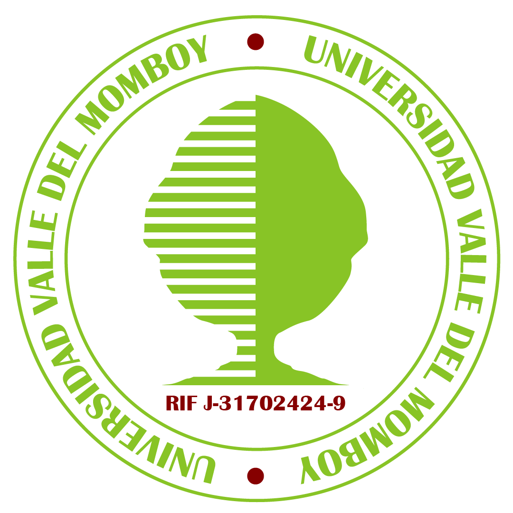

<p align="center">
  
</p>

# Manual de Buenas Prácticas para Trabajos Universitarios en Grupo

## Índice

1. [Introducción](#introducción)
2. [Normas de Citación y Referencias APA](#1-normas-de-citación-y-referencias-apa)
3. [Herramientas de Colaboración y Control de Versiones](#2-herramientas-de-colaboración-y-control-de-versiones)
4. [Estrategias de Gestión de Tiempos](#3-estrategias-de-gestión-de-tiempos)
5. [Estructura y Estándares de Presentación](#4-estructura-y-estándares-de-presentación)
6. [Buenas Prácticas en GitHub](#5-buenas-prácticas-en-github)
7. [Conclusiones](#conclusiones)


---

## Introducción

La realización de trabajos académicos en grupo es una competencia fundamental en la educación universitaria contemporánea. Este manual recopila las mejores prácticas para asegurar que la colaboración sea efectiva, eficiente y que produzca resultados de alta calidad. En particular, este documento enfatiza el uso de GitHub y Git como herramientas no solo para programadores, sino como instrumentos poderosos de gestión documental y control de versiones que cualquier estudiante puede dominar.

El éxito de un proyecto grupal depende de tres pilares fundamentales:

- **Organización clara**: estructura de trabajo definida y responsabilidades asignadas
- **Comunicación efectiva**: canales de comunicación bien establecidos y actualizados
- **Documentación rigurosa**: registro permanente de decisiones, cambios y progresos


A lo largo de este manual, exploraremos cómo implementar estas prácticas utilizando herramientas modernas que facilitan la colaboración sin importar la distancia geográfica o las diferencias horarias.

---

## 1. Normas de Citación y Referencias APA

### 1.1 Importancia de la Citación Académica

La integridad académica es el pilar fundamental de cualquier investigación universitaria. El uso correcto de las normas de citación no solo previene el plagio, sino que demuestra un respeto profundo por la propiedad intelectual y facilita la validación de argumentos expuestos en el trabajo. El formato APA (American Psychological Association), en su séptima edición, se ha convertido en el estándar de facto para las ciencias sociales, la psicología, la educación y disciplinas afines.

Una citación correcta permite que otros investigadores rastreen las fuentes originales, validen los hallazgos y construyan sobre el conocimiento existente. Además, proporciona credibilidad académica al demostrar que el trabajo se fundamenta en investigación seria y documentada.

### 1.2 Sistema de Citación en el Cuerpo del Texto

El formato APA utiliza el sistema autor-fecha para las citas. Es crucial entender la diferencia entre los dos tipos principales:

#### Citas Narrativas

En este tipo de cita, el apellido del autor aparece integrado en la oración, seguido del año de publicación entre paréntesis:

> Según García (2021), la colaboración efectiva requiere claridad en las responsabilidades.


#### Citas Parentéticas

En este caso, autor y año se colocan entre paréntesis al final de la idea:

> La colaboración efectiva requiere claridad en las responsabilidades (García, 2021).


#### Citas Textuales Cortas

Las citas directas de menos de 40 palabras se incluyen entre comillas dentro del párrafo:

> "El trabajo en equipo no es opcional en la educación moderna, sino una competencia esencial" (López y Martínez, 2020, p. 45).


#### Citas en Bloque

Las citas de más de 40 palabras requieren un formato especial: se presentan en párrafo aparte, con sangría, sin comillas y tamaño de fuente reducido:

```plaintext
La investigación sobre dinámicas de grupo subraya que:

    El éxito de cualquier proyecto colaborativo depende no solo de la suma 
    de habilidades individuales, sino de la capacidad del grupo para 
    sincronizarse, comunicarse efectivamente y resolver conflictos de 
    manera constructiva. Cuando estos elementos se alinean correctamente, 
    los resultados superan ampliamente lo que cualquier individuo podría 
    lograr solo. (Rodríguez et al., 2019, pp. 112-114)
```

### 1.3 Citas de Múltiples Autores

- **Dos autores**: Siempre se mencionan ambos (García y López, 2022)
- **Tres a cinco autores**: Se mencionan todos la primera vez; en citas posteriores, solo el primero seguido de "et al." (García et al., 2022)
- **Seis o más autores**: Se usa "et al." desde la primera cita (Smith et al., 2021)


### 1.4 Referencias Bibliográficas

La lista de referencias debe organizarse alfabéticamente al final del documento. Cada entrada debe seguir un formato específico según el tipo de fuente:

#### Libros

```plaintext
Apellido, Inicial. (Año). Título del libro en minúsculas. Editorial.
García, J. (2020). Metodología de investigación en ciencias sociales. 
    Pearson Educación.
```

#### Capítulos de Libros

```plaintext
Apellido, Inicial. (Año). Título del capítulo. En Inicial. Apellido (Ed.), 
    Título del libro (pp. xx-xx). Editorial.
López, M. (2021). Herramientas digitales para la colaboración. En J. García 
    (Ed.), Tecnología educativa contemporánea (pp. 156-189). McGraw-Hill.
```

#### Artículos de Revista

```plaintext
Apellido, Inicial. (Año). Título del artículo. Título de la Revista, volumen(número), 
    páginas. https://doi.org/xx.xxxx/xxxxx
Martínez, C., y Rodríguez, A. (2022). Impacto del trabajo remoto en la 
    productividad académica. Revista de Educación Digital, 15(3), 234-251. 
    https://doi.org/10.1234/red.2022.15.3.234
```

#### Sitios Web

```plaintext
Apellido, Inicial. (Año, mes, día). Título de la página. Sitio web. 
    Recuperado de https://www.ejemplo.com
Smith, J. (2023, noviembre 15). Guía completa de GitHub para principiantes. 
    GitHub Learning. Recuperado de https://github.com/learn/guides
```

#### Documentos sin Autor

```plaintext
Organización. (Año). Título del documento. Recuperado de https://www.ejemplo.com
American Psychological Association. (2020). Manual de publicación de la 
    American Psychological Association (7ª ed.). APA.
```

### 1.5 Elementos Importantes en APA 7ª Edición

En la séptima edición de APA, algunos cambios relevantes incluyen:

- Ya no es necesario incluir "Recuperado de" para sitios web, a menos que requiera fecha de recuperación
- Se recomienda incluir DOI en lugar de URL cuando esté disponible
- La sangría francesa se aplica en la lista de referencias
- Se permite el uso de minúsculas en títulos (excepto la primera palabra y nombres propios)


### 1.6 Evitación del Plagio

El plagio académico es una falta grave que compromete la integridad del estudiante. Existen varios tipos:

- **Plagio directo**: Copiar texto exacto sin atribución
- **Plagio de parafraseo**: Cambiar palabras pero mantener la estructura sin citar
- **Plagio de ideas**: Presentar conceptos de otros como propios
- **Autoplag iagio**: Reutilizar trabajo propio previo sin indicación


Para evitar el plagio, siempre cite las fuentes, incluso al parafrasear. Cuando sea posible, utilice herramientas como Turnitin o Copyscape para verificar la originalidad del trabajo.

---

## 2. Herramientas de Colaboración y Control de Versiones

### 2.1 GitHub: Más Allá de la Programación

Aunque GitHub fue creado originalmente para gestionar proyectos de software, se ha convertido en una plataforma versátil para cualquier tipo de trabajo colaborativo que requiera control de versiones. Para trabajos académicos, GitHub ofrece ventajas inigualables:

- **Historial completo de cambios**: Cada modificación queda registrada con autor, fecha y descripción
- **Trabajo paralelo**: Múltiples estudiantes pueden editar simultáneamente sin conflictos
- **Control de acceso**: Gestión de permisos para proteger el contenido
- **Documentación integrada**: README, wikis y páginas para explicar el proyecto


### 2.2 Estructura de Repositorio Recomendada

Una buena organización del repositorio es esencial para mantener el orden y facilitar la navegación:

```plaintext
manual-buenas-practicas/
├── README.md                 # Descripción general del proyecto
├── CHANGELOG.md              # Registro de cambios por versión
├── CONTRIBUTING.md           # Guía de contribución
├── documentos/
│   ├── 01-introduccion.md
│   ├── 02-citacion-apa.md
│   ├── 03-colaboracion.md
│   ├── 04-gestion-tiempos.md
│   └── 05-estructura-presentacion.md
├── imagenes/
│   ├── diagrama-flujo.png
│   ├── tabla-ejemplo-apa.png
│   └── captura-github.png
├── referencias/
│   ├── fuentes-academicas.txt
│   ├── enlaces-utiles.md
│   └── herramientas.csv
└── assets/
    └── manual-completo.pdf   # Versión final compilada
```

### 2.3 Flujo de Trabajo con Git y GitHub

#### Paso 1: Crear una Rama Local

Cada miembro del equipo debe crear una rama independiente para su sección:

```shellscript
git clone https://github.com/grupo/manual-buenas-practicas.git
cd manual-buenas-practicas
git checkout -b feature/seccion-citacion-apa
```

#### Paso 2: Realizar Cambios y Commits

Mientras trabaja en su sección, haga commits pequeños y descriptivos:

```shellscript
git add documentos/02-citacion-apa.md
git commit -m "Agregar ejemplos de citas textuales en APA"
```

Los mensajes de commit deben ser claros y específicos. Evite mensajes genéricos como "actualizar documento". En su lugar, use:

- ✅ "Añadir 5 ejemplos de citas parentéticas APA 7ª edición"
- ✅ "Corregir estructura de referencias bibliográficas"
- ✅ "Expandir sección de herramientas colaborativas"


#### Paso 3: Push y Pull Request

Una vez completada su sección, suba los cambios y cree un Pull Request:

```shellscript
git push origin feature/seccion-citacion-apa
```

Luego, en GitHub, cree un PR con:

- Título descriptivo
- Descripción detallada de cambios
- Referencias a issues relacionados (cierra con "Closes #123")
- Solicitud de revisores


#### Paso 4: Revisión por Pares

Los compañeros revisan el contenido, verifican:

- Coherencia con el resto del manual
- Corrección gramatical y ortográfica
- Consistencia en formato y citación
- Claridad de explicaciones


Los comentarios deben ser constructivos y específicos.

#### Paso 5: Merge a Main

Una vez aprobado, el PR se fusiona a la rama principal (main o master).

### 2.4 Herramientas Complementarias

#### Google Docs para Brainstorming Inicial

Para la fase inicial de lluvia de ideas, Google Docs permite edición simultánea en tiempo real:

- Acceso desde cualquier dispositivo
- Comentarios y sugerencias inmediatas
- Historial de versiones automático
- Exportación a Word o PDF


Limitación: No es ideal para documentos finales técnicos, que requieren control de versiones robusto.

#### Microsoft 365 para Edición Profesional

Office 365 ofrece ventajas para documentos más formales:

- Templates profesionales
- Integración con SharePoint
- Control avanzado de cambios
- Compatibilidad con sistemas corporativos


#### Markdown para Control de Versiones Óptimo

Markdown es el formato ideal para repositorios GitHub:

- Archivos de texto plano (legibles en cualquier editor)
- Bajo peso para repositorio
- Fácil de comparar cambios entre versiones
- Compatible con GitHub Pages para publicación web


### 2.5 Gestión de Proyectos en GitHub

El Project Board de GitHub es una herramienta tipo Kanban que visualiza el flujo de trabajo:

**Columnas típicas:**

- **📋 Por Hacer**: Nuevas tareas identificadas
- **🔄 En Progreso**: Asignadas y en desarrollo activo
- **👀 En Revisión**: Completadas, esperando review de pares
- **✅ Completado**: Aprobadas e integradas


**Ejemplo de tarjeta:**

```plaintext
Título: Expandir sección de citación APA
Descripción: 
- Agregar ejemplos de citas de múltiples autores
- Incluir casos de plagio y cómo evitarlo
- Crear tabla comparativa de formatos
Asignado a: @estudiante-a
Labels: seccion-2, documentacion, prioridad-alta
```

### 2.6 Manejo de Conflictos

Cuando dos estudiantes editan la misma sección simultáneamente, pueden surgir conflictos. Git ofrece herramientas para resolverlos:

```shellscript
git pull origin main
# Si hay conflictos, verá marcadores como:
# <<<<<<< HEAD
# versión local
# =======
# versión remota
# >>>>>>> origin/main
```

**Resolución:**

1. Edite el archivo manualmente, eligiendo qué versión mantener
2. `git add archivo-resuelto.md`
3. `git commit -m "Resolver conflicto de merge en sección X"`
4. `git push origin rama`


**Mejor práctica**: Coordinar entre estudiantes para evitar ediciones simultáneas en la misma sección.

---

## 3. Estrategias de Gestión de Tiempos

### 3.1 Metodología Pomodoro Aplicada

La técnica Pomodoro consiste en dividir el trabajo en bloques enfocados de 25 minutos, seguidos de descansos cortos. Esta técnica es especialmente efectiva para trabajos de redacción y investigación:

**Estructura de una sesión Pomodoro:**

1. **25 minutos de trabajo intenso**: Sin distracciones, sin redes sociales, sin interrupciones
2. **5 minutos de descanso**: Levantarse, caminar, hidratarse
3. **Repetir 4 veces**: Después de 4 Pomodoros, tomar un descanso de 15-30 minutos


**Beneficios:**

- Mantiene la concentración mental
- Evita el agotamiento prematuro
- Proporciona estructura clara
- Facilita el seguimiento de productividad


**Implementación en grupo:**

- Establecer sesiones de trabajo sincronizadas
- Usar aplicaciones como Forest o Be Focused para cronometrar
- Registrar en GitHub Issues cuántos Pomodoros dedicó cada estudiante


### 3.2 Matriz de Eisenhower

Esta matriz clasifica tareas en cuatro cuadrantes según su importancia y urgencia:

```plaintext
URGENCIA
   ↑
   │
   ├─────────────────────────────┬────────────────────────────────┤
   │ IMPORTANTE + URGENTE        │ IMPORTANTE + NO URGENTE        │
   │ (Hacer Inmediatamente)      │ (Planificar)                   │
   │ • Entrega en 24 horas       │ • Investigación exhaustiva     │
   │ • Bug crítico               │ • Estructura del manual        │
   │ • Crisis de equipo          │ • Revisión de pares            │
   ├─────────────────────────────┼────────────────────────────────┤
   │ NO IMPORTANTE + URGENTE     │ NO IMPORTANTE + NO URGENTE     │
   │ (Delegar)                   │ (Eliminar)                     │
   │ • Algunas reuniones         │ • Redes sociales               │
   │ • Interrupciones ajenas      │ • Email no crítico             │
   │ • Solicitudes menores        │ • Perfeccionismo innecesario   │
   └─────────────────────────────┴────────────────────────────────┘
                                    IMPORTANCIA →
```

**Aplicación al proyecto:**

- **Q1 (Urgente e Importante)**: Completar estructura general del manual, resolver conflictos de merge
- **Q2 (Importante, No Urgente)**: Investigación profunda, revisar ortografía, añadir gráficos
- **Q3 (Urgente, No Importante)**: Responder emails de grupo, actualizar tablero
- **Q4 (Ni importante ni urgente)**: Debates sobre detalles menores, cambios cosméticos


### 3.3 Cronograma Estructurado

Una planificación efectiva requiere un cronograma claro con hitos definidos:

**Ejemplo de calendario para proyecto de 4 semanas:**

| Semana | Fase | Actividades | Entregable
|-----|-----|-----|-----
| 1 | Planificación | Definir estructura, crear repo, asignar secciones | Repo activo + issues creados
| 2 | Redacción Inicial | Cada estudiante completa su sección (borrador) | 5 drafts en ramas
| 3 | Revisión y Mejora | Pull requests, comentarios, revisiones | Manual con v0.9 completo
| 4 | Finalización | Correcciones, compilación PDF, tags en GitHub | Manual v1.0 + GitHub completo


### 3.4 Deadlines Internos vs Externos

**Deadline externo**: Fecha establecida por el profesor (p. ej., viernes 15 de noviembre)

**Deadline interno recomendado**: Miércoles 13 de noviembre (48 horas antes)

Esta brecha permite:

- Resolver problemas técnicos de merge
- Corregir errores ortográficos de última hora
- Asegurar que todos los cambios estén compilados
- Generar PDF final sin prisa


### 3.5 Sincronización de Equipo

**Reuniones semanales sugeridas:**

- **Lunes**: Planificación semanal (30 minutos)
- **Viernes**: Revisión de progreso (30 minutos)


**Comunicación asincrónica:**

- Discord o Slack para preguntas rápidas
- GitHub Issues para discusiones técnicas
- Email para comunicaciones formales


**Registro centralizado:**

- Usar Wiki de GitHub para documentar decisiones
- Actualizar Project Board después de cada sesión
- Mantener CHANGELOG actualizado


### 3.6 Estrategias Anti-Procrastinación

1. **Comienza pequeño**: Los primeros 5 minutos son los más difíciles
2. **Visualiza el éxito**: Imagina el manual completado y de alta calidad
3. **Compromiso público**: Anuncia tu deadline a los compañeros
4. **Recompensas**: Celebra cada hito alcanzado
5. **Eliminación de fricción**: Facilita el inicio (abre el archivo, pon música, prepara el entorno)
6. **Accountability partner**: Trabaja junto a alguien más en la misma sección


---

## 4. Estructura y Estándares de Presentación

### 4.1 Principios de Diseño de Documentos

La presentación visual es tan importante como el contenido. Un documento mal estructurado perderá lectores incluso si el contenido es excelente. Los principios fundamentales son:

#### Jerarquía Clara

Los encabezados deben indicar la importancia relativa:

- **H1 (#)**: Título principal del documento - una sola vez
- **H2 (##)**: Secciones mayores - 4-6 por documento
- **H3 (###)**: Subsecciones - Dentro de cada H2
- **H4 (####)**: Detalles específicos - Cuando necesaria mayor profundidad


En Markdown:

```markdown
# Título Principal (H1)
## Sección 1 (H2)
### Subsección 1.1 (H3)
Contenido del párrafo
```

#### Legibilidad Tipográfica

Para documentos digitales y impresos:

- **Fuente para cuerpo**: Times New Roman 12pt o Arial 11pt
- **Fuente para títulos**: Helvetica 16-18pt o Arial Bold
- **Interlineado**: 1.5 a doble espacio en trabajos académicos
- **Márgenes**: 2.5cm en todos los lados (estándar APA)
- **Alineación**: Justificada para cuerpo, izquierda para títulos


#### Uso del Espacio en Blanco

El espacio en blanco no es desperdicio, es aire visual que hace que el documento respire:

- Márgenes generosos alrededor del contenido
- Espaciado entre párrafos (1 línea vacía)
- Espaciado entre secciones (2 líneas vacías)
- Máximo 70-80 caracteres por línea en código


### 4.2 Elementos Gráficos y Multimedia

#### Tablas

Las tablas deben ser claras y accesibles:

```markdown
| Elemento | Función | Ejemplo |
|----------|---------|---------|
| H1 | Título principal | # Introducción |
| H2 | Secciones | ## Metodología |
| Párrafo | Texto corrido | Explicación detallada |
| Bullet | Lista simple | - Item 1 |
```

En documentos finales, las tablas deben incluir:

- Encabezados claramente diferenciados
- Bordes visibles
- Alineación consistente
- Título y número (Tabla 1: Comparativa de herramientas)


#### Imágenes y Diagramas

Toda imagen debe cumplir criterios de calidad:

- **Resolución mínima**: 300 DPI para impresión, 72 DPI para web
- **Tamaño**: No exceder 2-3 MB por imagen
- **Formato**: PNG para gráficos, JPG para fotografías
- **Ubicación**: Centrada o alineada a izquierda consistentemente
- **Pie de foto**: "Figura 1: Descripción clara y concisa"
- **Referencia en texto**: "Como se muestra en la Figura 1..."


Tipos de gráficos útiles para manuales:

- **Diagramas de flujo**: Procesos y pasos secuenciales
- **Capturas de pantalla**: Instrucciones paso a paso
- **Gráficos estadísticos**: Datos y comparativas
- **Infografías**: Resúmenes visuales de conceptos complejos


#### Listas

Usar consistentemente dos tipos:

**Listas no ordenadas** (para elementos sin secuencia):

- Elemento 1
- Elemento 2
- Elemento 3


**Listas ordenadas** (para pasos secuenciales):

1. Primer paso
2. Segundo paso
3. Tercer paso


### 4.3 Estructura de Documento Formal

Un manual académico debe incluir:

**Portada**

- Título del trabajo
- Nombre de la institución
- Nombre de autores
- Fecha de entrega
- Código de curso/asignatura


**Tabla de Contenidos**

```markdown
# Tabla de Contenidos

1. Introducción
2. Marco Teórico
3. Metodología
   3.1 Enfoque
   3.2 Participantes
   3.3 Procedimiento
4. Resultados
5. Discusión
6. Conclusiones
7. Referencias Bibliográficas
```

**Introducción**

- Contexto y relevancia
- Objetivos claros
- Estructura del documento
- Preguntas investigativas (si aplica)


**Cuerpo Principal**

- Secciones lógicamente ordenadas
- Transiciones claras entre secciones
- Párrafos bien desarrollados (4-6 oraciones)
- Citas y referencias integradas


**Conclusiones**

- Resumen de hallazgos principales
- Respuesta a objetivos planteados
- Implicaciones prácticas
- Sugerencias para investigación futura


**Referencias Bibliográficas**

- Ordenadas alfabéticamente
- Formato APA consistente
- Sangría francesa en cada entrada


### 4.4 Revisión Final de Formato

Antes de enviar la versión final, realizar verificación de checklist:

```plaintext
CHECKLIST DE FORMATO FINAL
├── Ortografía y Gramática
│   ├── Revisar con corrector automático
│   ├── Leer en voz alta para fluidez
│   └── Verificar tecnicismos y terminología
├── Consistencia Visual
│   ├── Fuentes uniformes en todo el documento
│   ├── Encabezados con mismo formato
│   ├── Márgenes consistentes
│   └── Numeración de páginas
├── Referencias y Citas
│   ├── Todas las citas tienen referencia
│   ├── Todas las referencias están citadas
│   ├── Formato APA correcto
│   └── URLs activas
├── Elementos Gráficos
│   ├── Imágenes con alta resolución
│   ├── Figuras numeradas y referenciadas
│   ├── Tablas con títulos
│   └── Pies de página apropiados
├── Navegación
│   ├── Tabla de contenidos actualizada
│   ├── Saltos de página correctos
│   ├── Índice de figuras/tablas (si aplica)
│   └── Enlaces internos funcionales
└── Distribución
    ├── Párrafos evitan viudas/huérfanos
    ├── Espaciado consistente
    ├── Sin líneas en blanco innecesarias
    └── Documento legible en pantalla y papel
```

### 4.5 Exportación a PDF

Markdown se puede convertir a PDF de varias formas:

**Opción 1: Pandoc (recomendado para académico)**

```shellscript
pandoc manual.md -o manual.pdf \
  --template=eisvogel \
  --toc \
  --toc-depth=2 \
  --citeproc
```

**Opción 2: Print to PDF desde navegador**

- Abra el archivo en navegador
- Ctrl+P (o Cmd+P en Mac)
- Guardar como PDF
- Asegúrese de márgenes adecuados


**Opción 3: GitHub Pages + Print**

- Publique el manual en GitHub Pages
- Desde el navegador, use la función de impresión


---

## 5. Buenas Prácticas en GitHub

### 5.1 Administración de Repositorio

#### Configuración Inicial

```shellscript
# Crear repositorio
git init manual-buenas-practicas
cd manual-buenas-practicas

# Configurar usuario (si es primera vez)
git config user.name "Tu Nombre"
git config user.email "tu.email@universidad.edu"

# Crear rama principal
git branch -M main
```

#### .gitignore para Manuales

```plaintext
# Archivos temporales
*.tmp
*.bak
*~

# Archivos del sistema
.DS_Store
Thumbs.db

# Software específico
.vscode/
.idea/

# Archivos compilados
*.pdf  # Opcional: si el PDF se regenera
*.docx
*.xlsx

# Dependencias
node_modules/
__pycache__/
```

### 5.2 Convenciones de Ramas

Las ramas deben nombradas de forma consistente para fácil identificación:

```plaintext
feature/descripcion-corta       # Nuevas secciones
bugfix/descripcion-del-error    # Correcciones
docs/mejora-documentacion       # Cambios en documentación
style/corregir-formato          # Cambios de formato solo
```

Ejemplos correctos:

- `feature/seccion-citacion-apa`
- `bugfix/corregir-referencia-perdida`
- `docs/mejorar-readme`


Ejemplos incorrectos (evitar):

- `seccion2` (no descriptivo)
- `actualizar` (muy vago)
- `mi-trabajo` (no profesional)
- `main-v2` (crea confusión)


### 5.3 Mensajes de Commit Significativos

**Formato recomendado:**

```plaintext
<tipo>(<alcance>): <descripción corta>

<descripción detallada si es necesario>

<referencias a issues>
```

**Tipos comunes:**

- `feat`: Nueva característica o sección
- `fix`: Corrección de errores
- `docs`: Cambios en documentación
- `style`: Cambios de formato o estilos
- `refactor`: Reorganización de contenido
- `test`: Cambios en pruebas (si aplica)


**Ejemplos:**

```plaintext
feat(citacion): agregar ejemplos de citas en bloque

- Agregados 4 ejemplos de citas de más de 40 palabras
- Incluido formato con sangría según APA 7ª
- Añadidos números de página

Closes #23
```

```plaintext
fix(referencias): corregir formato de DOI en bibliografía

El formato anterior no incluía el prefijo https://doi.org/

Closes #45
```

### 5.4 Sistema de Issues

Los issues son el centro de organización del proyecto:

**Crear Issue para cada tarea:**

```plaintext
Title: Escribir sección de Herramientas Colaborativas

Description:
Esta sección debe incluir:
- [ ] Introducción a herramientas de colaboración
- [ ] GitHub y control de versiones
- [ ] Google Docs vs Microsoft 365
- [ ] Herramientas de comunicación (Slack, Discord)
- [ ] Mínimo 5 fuentes académicas
- [ ] 2-3 imágenes demostrativas

Assigned to: @estudiante-b
Labels: seccion-2, documentacion, contenido
Milestone: Versión 0.9
Due date: 15 de noviembre
```

**Convenciones de etiquetas (labels):**

- `seccion-1`, `seccion-2`, etc.: Identifican sección
- `contenido`: Nuevo contenido escrito
- `revisar`: Pendiente de revisión por pares
- `mergeado`: Completado e integrado
- `prioridad-alta`, `prioridad-media`, `prioridad-baja`
- `bug`: Error o inconsistencia encontrada


### 5.5 Pull Request Efectivos

**Estructura de PR:**

```plaintext
## Descripción
Breve resumen de qué cambios se realizaron y por qué.

Escribí la sección completa sobre citación APA, incluyendo:
- Explicación de sistema autor-fecha
- Diferencia entre citas narrativas y parentéticas
- Formato de referencias bibliográficas
- 8 ejemplos completos

## Cambios realizados
- Documento: `documentos/02-citacion-apa.md` (850 palabras nuevas)
- Imágenes: `imagenes/tabla-formatos-apa.png` (agregada)
- Referencias: Añadidas 7 nuevas fuentes en `referencias/fuentes.txt`

## Verificación
- [x] Contenido revisado por mi
- [x] Ortografía y gramática corregidas
- [x] Imágenes en lugar (300 DPI mínimo)
- [x] Formato APA en ejemplos
- [ ] Esperando revisión de compañero

## Solicita revisión
@estudiante-c @estudiante-d

Closes #23
```

**Checklist para revisor:**

```plaintext
## Revisión de Contenido
- [ ] Contenido es claro y bien estructurado
- [ ] Sin errores ortográficos o gramaticales
- [ ] Citas y referencias en formato APA
- [ ] Coherencia con resto del manual

## Revisión de Formato
- [ ] Sigue estructura de encabezados
- [ ] Imágenes bien integradas
- [ ] Espaciado y márgenes consistentes
- [ ] Longitud apropiada (no demasiado breve o largo)

## Aprobar / Solicitar cambios
```

### 5.6 Versionado Semántico

Usar etiquetas (tags) para marcar versiones:

```shellscript
# Ver versiones existentes
git tag

# Crear nueva versión
git tag -a v1.0 -m "Manual v1.0 - Versión final completada"

# Enviar tags a remoto
git push origin --tags
```

**Esquema de versiones:**

- `v0.1`: Primeras secciones redactadas
- `v0.5`: Manual 50% completado
- `v0.9`: Borrador casi final
- `v1.0`: Versión final completada
- `v1.1`: Correcciones menores post-entrega
- `v2.0`: Revisión completa o nueva edición


